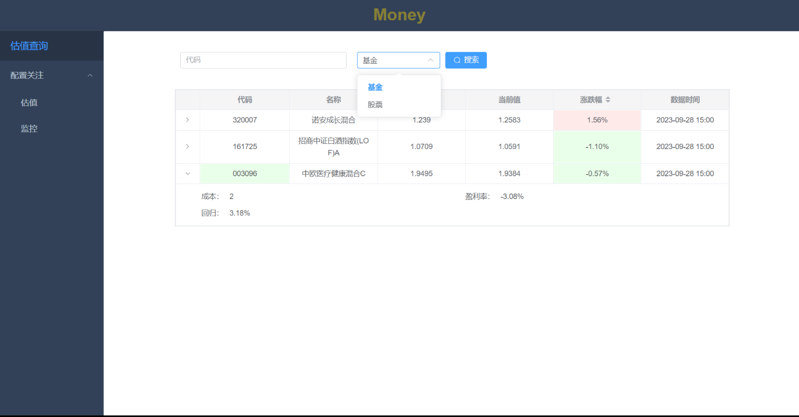

# 股票、基金的估值及监控

基于东方财富API实现的的估值查询及定时监控，可定时推送消息。

[文档](https://github.com/fevolq/Money/wiki)

> 有任何疑问或发现异常， 请 [issue](https://github.com/fevolq/Money/issues/new?assignees=&labels=&template=bug_report.md&title=)

# 基本功能
* 估值查询
* 定时推送估值
* 监控估值与涨跌幅（基于成本）

# 界面展示
